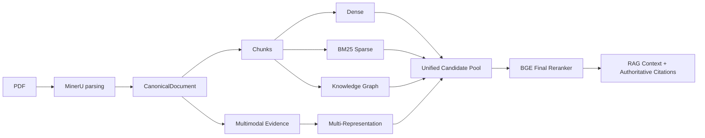

# KnowledgeScope

面向复杂文档的可追溯知识检索与 RAG 系统。

KnowledgeScope 将 PDF 转换为 parser-independent 的 `CanonicalDocument`，再生成带有
完整来源 lineage 的 chunks、Evidence 和检索表示。系统返回的内容可以追溯到文档、页码、
source block，以及适用时的原始图片或表格资产。

[快速开始](#快速开始) · [系统架构](#系统架构) · [检索评测](#检索评测)

[](https://www.python.org/)
[](https://fastapi.tiangolo.com/)
[](https://vuejs.org/)
[](https://www.postgresql.org/)
[](https://qdrant.tech/)
[](https://neo4j.com/)

## 核心能力

### 文档理解

MinerU 解析 PDF，输出与解析器无关的 `CanonicalDocument`。页面、标题、正文、表格、
公式和图片都保留规范化的页码、block 与资产 lineage；结构化分块产生可重复的 `Chunk`。

### 混合检索

Dense、BM25 Sparse 和 Knowledge Graph 分支分别生成候选。Qdrant、SQLite 和 Neo4j 保存
各自的派生索引，查询结果保留 `knowledge_base_id`、文档、页面、chunk 和 source block。

### 多模态 Evidence

text、image、table、formula 都可以作为 Evidence 来源，并拥有多个文本化 representation，
例如表格 Markdown、公式 LaTeX、图片 caption 或附近上下文。representation 只用于搜索，
权威内容仍来自 Evidence；系统不把图片本身当作文本，也不声称已具备视觉 embedding 检索。

### 证据约束的 RAG

统一候选池交给 BGE final reranker，再组装 RAG context。应用生成确定性的 citation marker，
每个 citation 都能回到真实的 document/page/block/evidence lineage。

### AI 问答

前端 AI 问答工作区连接现有 RAG SSE 接口，支持选择知识库、流式回答和可回看的来源卡片。对话暂存于当前浏览器会话，引用保留文档、页码和 source block lineage。

### 以评测为约束

检索路径提供只读、可复现的离线评测和消融记录。评测使用冻结的标注、索引和数据快照，
结果用于比较具体配置，不替代生产环境的质量或延迟承诺。

### ChatBI schema

外部 PostgreSQL 数据源可读取表、视图、字段、主外键与注释，并生成用于后续数据分析的结构化 Schema Context。

### ChatBI SQL

已注册的数据源可以通过 `knowledgescope chatbi execute <datasource_id> <sql>` 执行受策略约束的只读查询，返回有界、JSON-safe 的表格结果和执行审计信息。

已注册的数据源也可以通过 `knowledgescope chatbi ask <datasource_id> <question>` 完成有界的 SQL 生成、只读执行和结果分析。

Web 端的数据分析工作区复用同一条注册数据源、Eligibility、SQL 校验、只读执行和结果分析链路，
以表格展示真实结果，并在数据形状合适时提供确定性图表。

本地 MCP 客户端可以通过 stdio 调用 `chatbi_ask` 和 `chatbi_schema`，复用相同的注册数据源、Schema Discovery 与只读 ChatBI 流程。

## 系统架构



所有索引都是可重建的派生状态。PostgreSQL 保存应用元数据，Qdrant 保存向量，Neo4j 保存
有证据支撑的图数据，SQLite 保存 Sparse index；这些跨存储操作不构成分布式原子事务。

## 系统快照

以下数字描述仓库使用的 corpus/index 快照，不是生产规模上限：

| 对象 | 数量 |
| --- | ---: |
| unique documents | 255 |
| canonical blocks | 46,504 |
| chunks | 7,524 |
| searchable multimodal representations | 79,338 |

## 检索评测

最终冻结评测的 test split 包含 36 条 query。指标使用冻结的检索标注语义；延迟是本机
warm execution 的 query-level mean，不包含答案生成 LLM。

| Retrieval | Hit@1 | Hit@3 | Hit@10 | MRR | Warm mean latency |
| --- | ---: | ---: | ---: | ---: | ---: |
| Dense | 77.78% | 83.33% | 86.11% | 0.8079 | 166 ms |
| Dense + Sparse | 80.56% | 97.22% | 100.00% | 0.8852 | 451 ms |
| Dense + Graph | 77.78% | 91.67% | 94.44% | 0.8449 | 2.45 s |

在这套冻结 test set 上，Dense + Sparse 产生了最强的通用检索结果。所有检索分支同时运行
提高了 Top-10 覆盖，但削弱了早期排序；KnowledgeScope 不把更多检索器视为自动收益。

完整协议、dev/all-108 结果、坏例分析和多模态评测见
[检索评测报告](docs/benchmarks/a4-5-retrieval-evaluation.md)。

## 快速开始

### 环境

- Python 3.12
- `uv`
- Node.js 与 `npm`
- Docker Compose

### 启动后端

```bash
uv sync
cp .env.example .env
docker compose up -d
uv run alembic upgrade head
uv run uvicorn knowledge_scope.api.app:app --reload
```

API 默认地址为 `http://127.0.0.1:8000`。`.env` 仅用于本地配置并已被 Git 忽略；请不要
在其中或其他仓库文件中提交密码、API key 或 token。

### 启动前端

在另一个终端执行：

```bash
cd frontend
npm install
npm run dev
```

前端默认地址为 `http://localhost:5173`，Vite 会把 `/api` 请求代理到本地后端。

## 技术栈

| 组件 | 用途 |
| --- | --- |
| Python 3.12 / FastAPI / SQLAlchemy | API、领域模型和 PostgreSQL 访问 |
| Vue 3 / TypeScript / Vite | Web 界面 |
| PostgreSQL | 知识库、文档和应用元数据 |
| Qdrant | Dense 与 representation 向量索引 |
| Neo4j | 有证据支撑的知识图谱和图检索 |
| MinerU | PDF 解析适配器 |
| Qwen3-Embedding / BGE Reranker | Dense embedding 与候选重排 |

## 仓库结构

```text
KnowledgeScope/
├── src/knowledge_scope/  后端 package
├── frontend/             Vue 3 应用
├── docs/                 架构、集成、评测和验证文档
├── tests/                pytest 与可选集成测试
├── alembic/              PostgreSQL migrations
└── compose.yaml          本地基础设施
```

## 文档

| 主题 | 文档 |
| --- | --- |
| 规范化文档模型 | [CanonicalDocument](docs/architecture/canonical-document-model.md) |
| 结构感知分块 | [CanonicalDocument → Chunk](docs/architecture/canonical-document-chunking.md) |
| RAG 与 citations | [RAG QA](docs/architecture/rag-qa.md) |
| 知识图谱检索 | [Graph Retrieval](docs/architecture/graph-retrieval.md) |
| 统一候选池 | [Unified Retrieval](docs/architecture/unified-retrieval.md) |
| 多模态 Evidence | [Multimodal Evidence](docs/architecture/multimodal-evidence.md) |
| ChatBI schema discovery | [Schema Discovery](docs/architecture/chatbi-schema-discovery.md) |
| ChatBI SQL execution | [SQL Execution](docs/architecture/chatbi-sql-execution.md) |
| ChatBI agent loop | [ChatBI Agent](docs/architecture/chatbi-agent.md) |
| ChatBI 数据分析工作区 | [Analysis Workspace](docs/architecture/chatbi-analysis-workspace.md) |
| 本地 MCP 服务 | [MCP 服务](docs/architecture/mcp-server.md) |
| 检索评测 | [Retrieval Evaluation](docs/benchmarks/a4-5-retrieval-evaluation.md) |
| 开发记录 | [Project History](docs/development/project-history.md) |

## 路线图

路线图列出尚未进入产品表面的工作：

- 面向更复杂任务的 Agent 工具循环；
- 更完整的 GraphRAG 与跨文档实体链接评测；
- 视觉 embedding、OCR/LLM caption 规模化生成，以及更严格的多模态质量评测。

详细实现背景、协议限制和历史记录分别保存在 `docs/architecture/`、`docs/benchmarks/`
和 [Project History](docs/development/project-history.md) 中。
